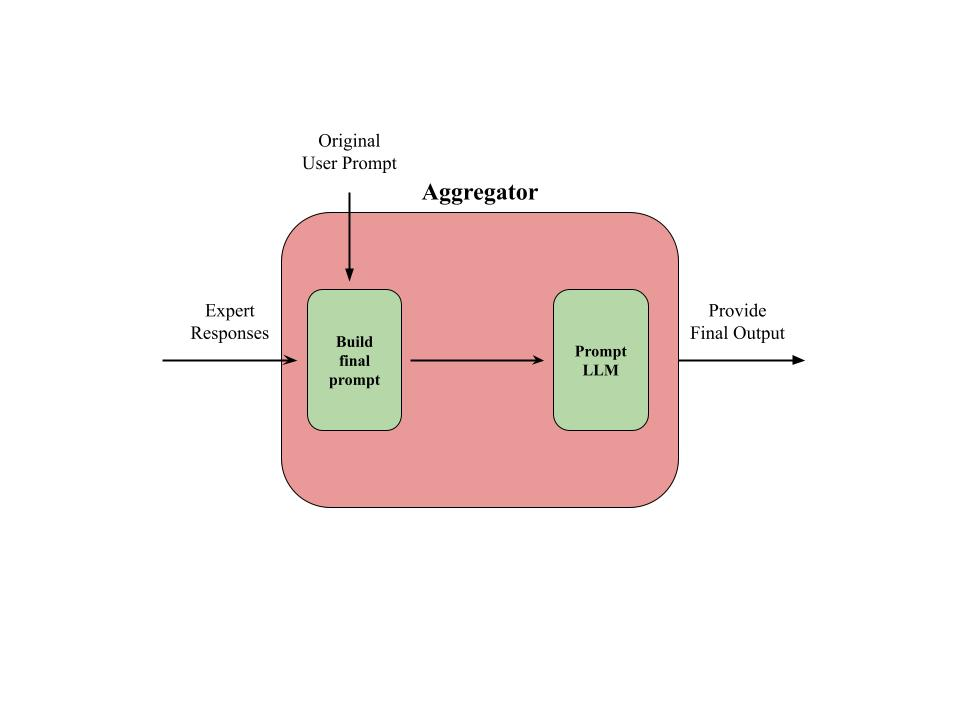

# Prototype for Heterogenous Experts with Routing Decisions (HERD) 
HERD is an approach to multi-model reasoning that utilizes multiple independent models fine-tuned to be experts on different subjects. The HERD interface will take a prompt like a traditional chat-based LLM and decompose it into its core topics, assign different experts to components of the prompt, and aggregate the expert answers into one coherent output. This repository is a prototype implementation of HERD at RCOS. 

## Prototype Architecture
The architecture of HERD will have tree main components: Router, Experts, and Aggregator. The architecture of HERD can be thought of as a simplified version of how the human brain approaches problem solving using LLMs. 
### Router
The router will handel inputs prompts for HERD and is synonomus to how the human brain interprets a given task. The job of the router will be to take in a prompt as an argument, decompose the 
prompt into its core topics, and create specialized prompts for relevant experts based on the input. Figure One visualizes how 
the router will operate. 

**Router Diagram**

The router itself will be comprised of three major algorithms
* <b>Interpreter:</b> The interpreter will be a natural language processing reinforcement learning algorithm trained to decompose
prompts into their core topics. This is a relatively well developed area of machine learning research, so many techniques and approaches will be borrowed from well established research. From figure one, the interpreter will be take on the role of the first step.    
* <b>Mapper:</b> The mapper will be an intelligent algorithm capable of creating a multiple-to-one mapping for topics and experts. The mapper will supply information about what experts to prompt and context to build each prompt around. From Figure One, the mapper will take on the role of the second step.   
* <b>Prompter:</b> The prompter will take the information supplied by the mapper to and use it as context to create prompts for the experts. The prompter will heavily utilize prompt engineering libraries like LangChain to create optimized prompts for each expert. From figure one, the prompter will take on the role of the third step.

### Experts
The experts will serve as the brain of the HERD architecture. Similarly to how the human brain is comprised of multiple specialized cortexes, the brain of HERD is comprised of multiple specialized LLMs. Each individual expert that makes up the brain of HERD will be fine tuned to a specific domain of knowledge, and activated only when the prompt requires specific input from their domain. 
Figure two represents how the experts will fit into the HERD architecture. 

**Experts Diagram**
  

The experts will consist of fine-tuned Llama LLMs that are partly pre-trained from HuggingFace. The experts will formulate their outputs as to provide suitable information for the aggregator LLM to answer the question. 
### Aggregator
The aggregator section of HERD can be thought of as the speech component of the HERD architecture. After the experts have addressed all components of the original prompt and provided all of the expert-specific context needed to answer the user prompt, the aggregator LLM will be given the original user prompt as well as all the expert context and tasked to answer the prompt using this context. Figure Three visualizes the role of the aggregator. 

**Aggregator Diagram**
  

### Architecture Summary
Our approach to HERD is largely modeled after how the human brain processes complex tasks. Figure Four visualizes how each core component of HERD works together to provide highly accurate answers to a given prompt. 

**Full HERD Architecture**
  

**Run Server on Local**
cd frontend
npm run dev