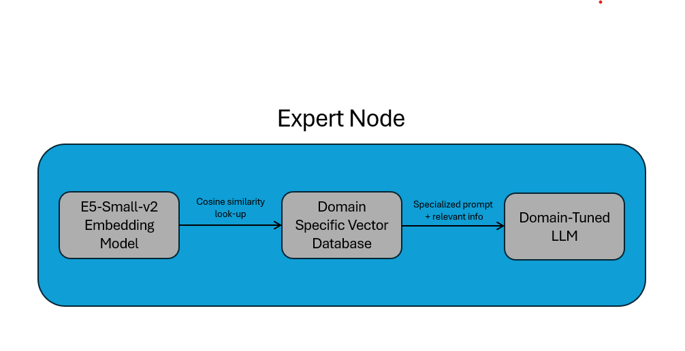

# HERD's Brain
The brain of HERD is composed of isolated containers called *expert nodes*, each contributing domain specific knowledge to its reasoning capability. The nodes of HERD's brain are managed using Kubernetes and Docker, allowing for seamless addition and deletion of certain knowledge, similar to how the human brain prunes neurons. This README covers the composition of a singe expert node as well as how they are orchestrated and managed to create a single heterogenous brain. 

## Single-Node Composition
Each expert node is built from a base Docker image hosted on HERD’s Docker Hub. The image includes a pre-configured Python virtual environment, exposes an `/infer` API endpoint on port 8000, and gives the expert node RAG utility. Each expert node container is mounted with a domain-tuned LLM and vector database for RAG. The specific composition of each node is controlled by the `expert-chart/values.yaml` file. Figure One demonstrates how a specialized prompt is used in RAG for an expert node. 

<figure>
  
  <figcaption style="text-align:center;"><b>Figure 1.</b> Per-Node RAG for Experts</figcaption>
</figure>

## Expert Node Orchestration

The initial composition of HERD's brain is created at runtime using Kubernetes and Helm by referencing the models defined in `expert-chart/values.yaml`. While the network is active the node composition can be altered in the following ways: 

- **Add Expert**: Experts can be added by first updating the config file and then running:  

  ```bash
  helm upgrade experts ./experts-chart
- **Remove Expert**: Experts can be removed by running:
  ```bash
  kubectl delete deployment expert4
  kubectl delete service expert4
- **Scale Expert**: Experts can be scaled up or down using Kubernetes. For example: 
    ```bash
    kubectl scale deployment expert2 --replicas=3
    ```

